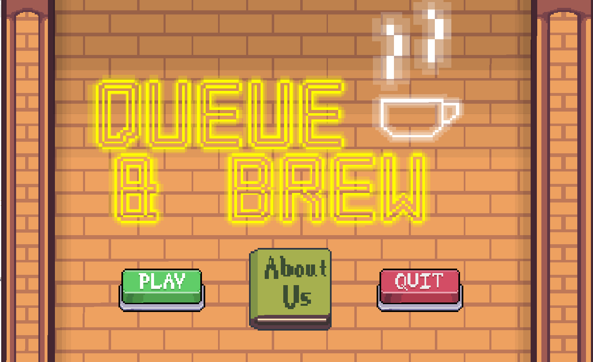
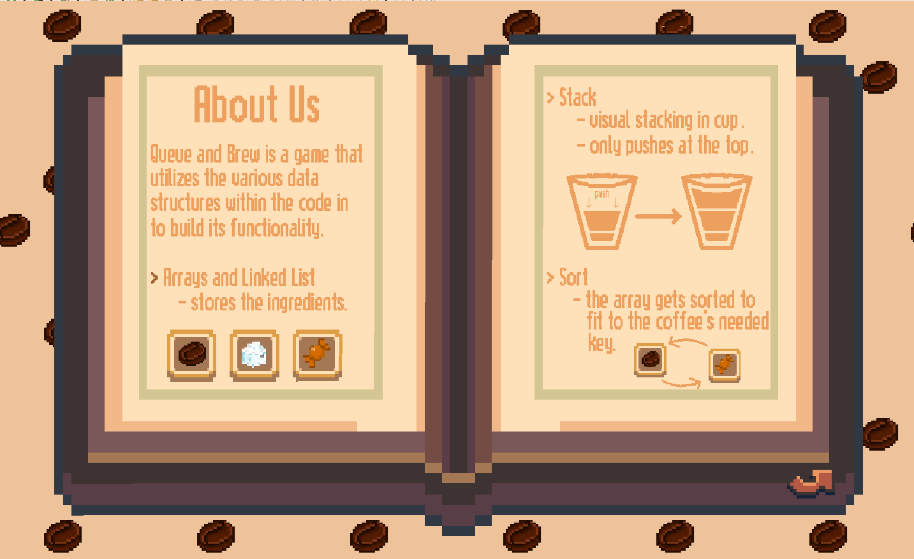
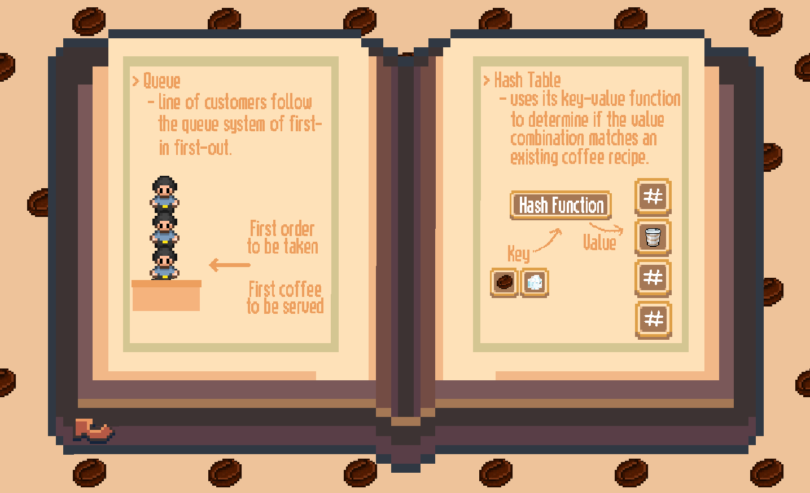
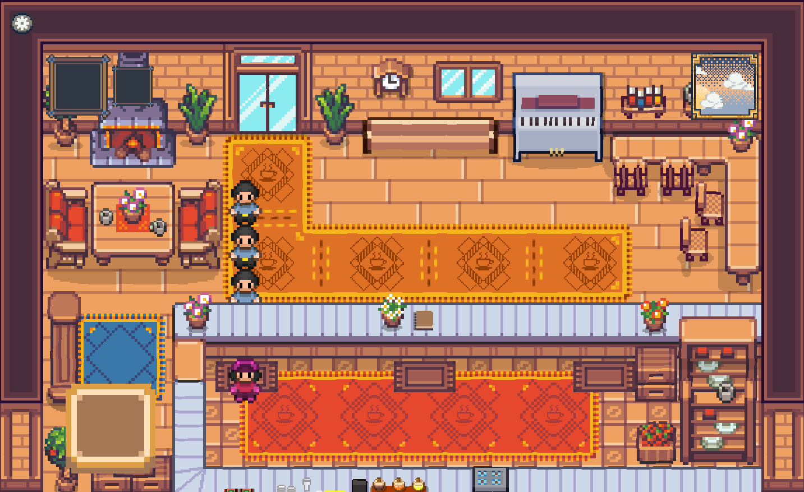
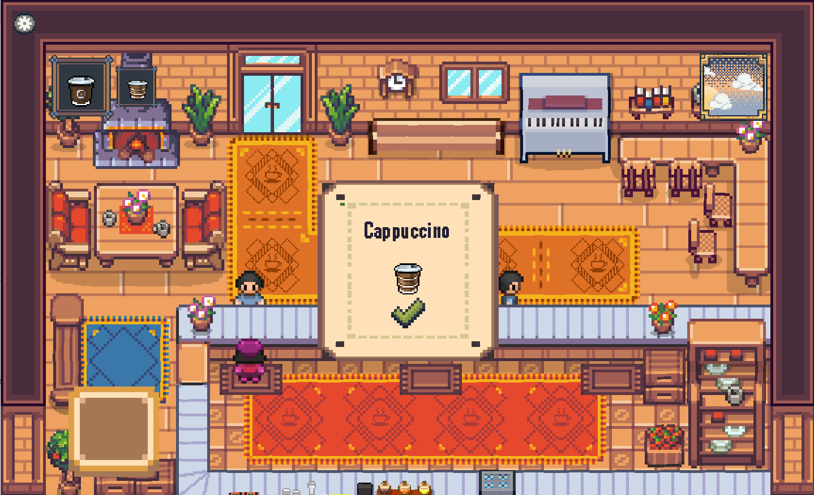
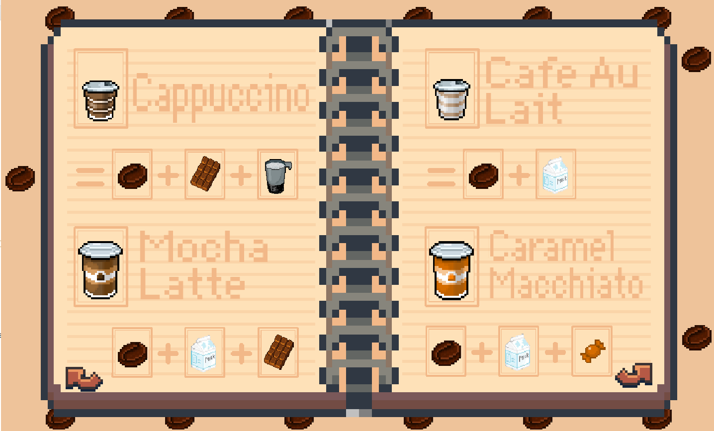
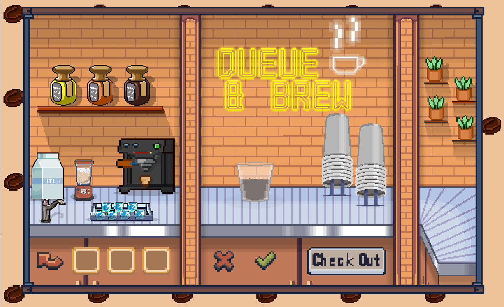
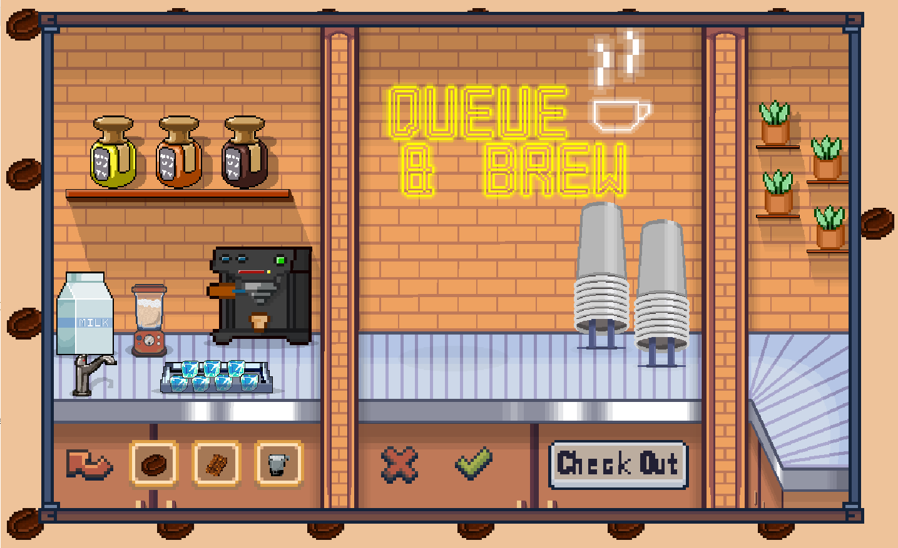
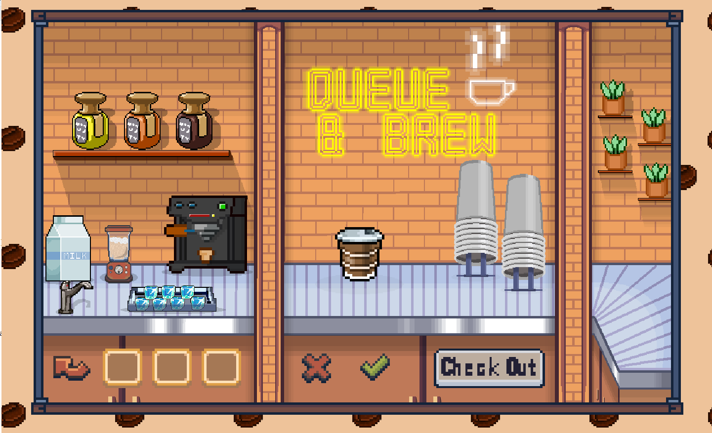
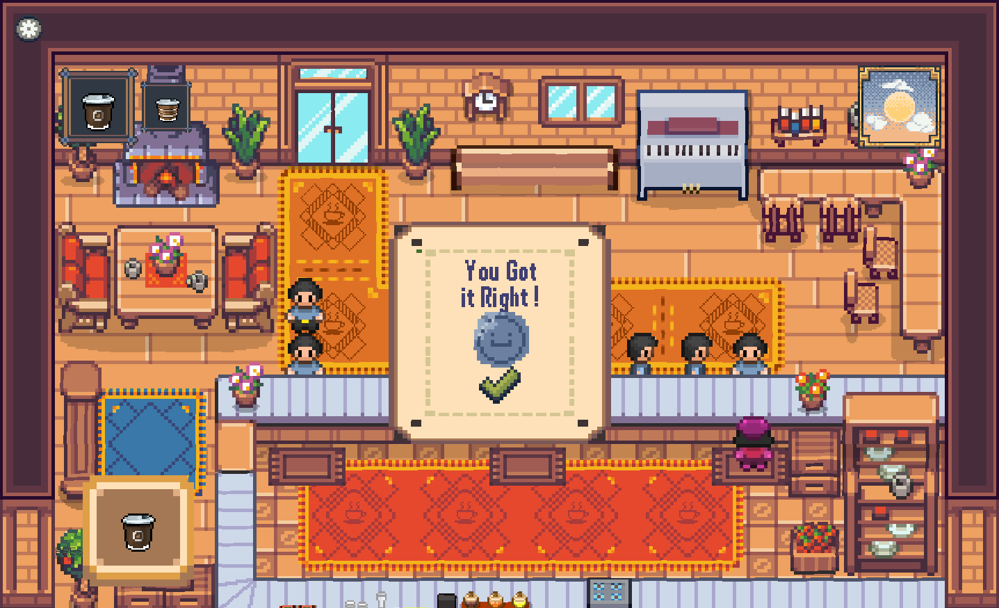

# Queue & Brew ☕

<h2>Description</h2>
Queue & Brew is an educational simulation game built in Java that visualizes core computer science data structures. Through the engaging mechanics of running a coffee shop, the game actively demonstrates how different data structures operate under the hood to manage customers, ingredients, and logic.
 

<h2>Languages and Utilities Used</h2>

- <b>Java</b> 
- <b>Aseprite</b>
  
<h2>Data Structures Visualized</h2>

- <b>Queues:</b> Manages the First-In-First-Out (FIFO) line of waiting customers.
- <b>Stacks:</b> Handles the visual stacking of ingredients as they are pushed into the coffee cup.
- <b>Arrays & Linked Lists:</b> Used to dynamically store and manage the selected ingredient items.
- <b>Hash Tables:</b> Utilizes a key-value function to determine if a combination of ingredients matches an existing coffee recipe.

<h2>Program walk-through:</h2>

<b>Main Menu:</b>  
The player is greeted by the Queue & Brew neon sign and can access the game or the educational glossary. 

 
 
<b>Interactive Glossary:</b>  
An in-game "About Us" book explains the specific data structures utilized within the code, such as Arrays, Linked Lists, Stacks, and Sorting. It also details the logic behind the Queue and Hash Table integrations. 

 

 
 
<b>Customer Queue Management (FIFO):</b>  
During gameplay, a line of customers forms, visually representing a First-In-First-Out queue system. 

 
 
<b>Order Processing:</b>  
The player interacts with the first customer in the queue to receive their specific order, such as a Cappuccino. 

 
 
<b>Recipe Reference (Hash Table Validation):</b>  
Players can consult the recipe book to learn the correct ingredient combinations needed to satisfy the Hash Table validation. 

 
 
<b>Brewing Station (Stacks & Arrays):</b>  
The player moves to the brewing station, starting with an empty cup. 

 
They select the necessary ingredients, storing them in the data structure. 

 
Once processed, the final beverage is rendered. 

 
 
<b>Order Fulfillment:</b>  
Serving the correct beverage to the customer clears them from the Queue, allowing the next customer's order to be processed. 

